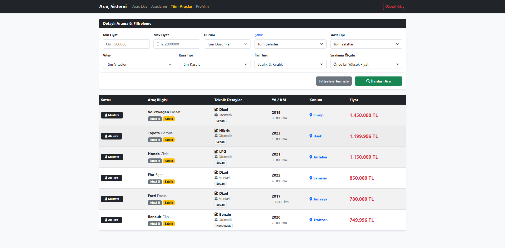
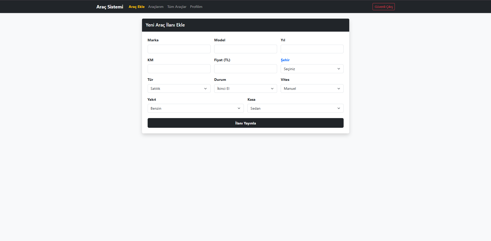
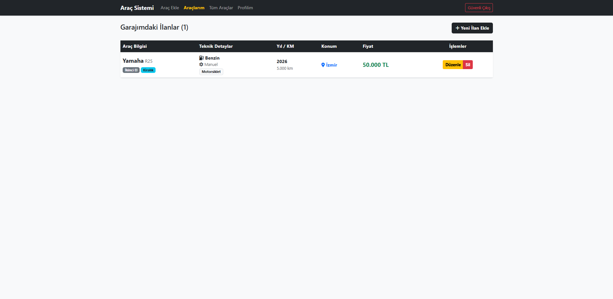
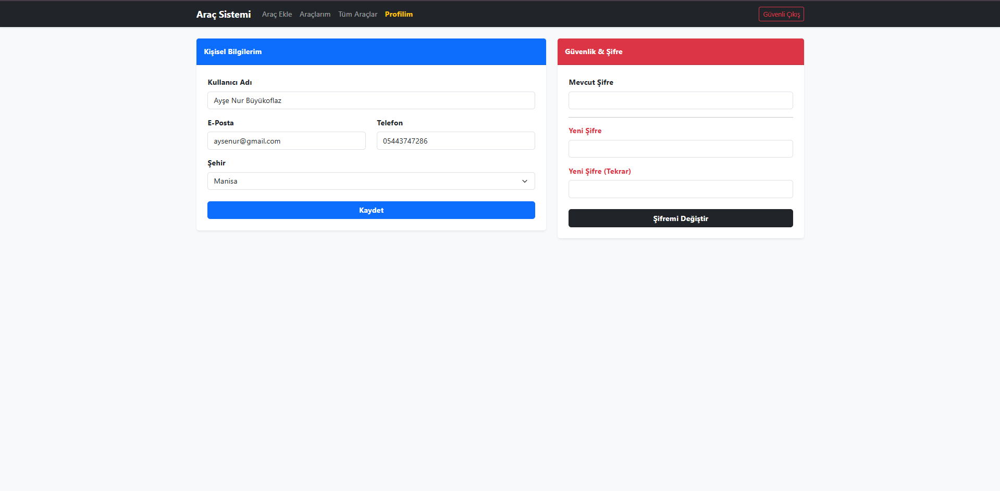

# 🚗 Gelişmiş Araç İlan ve Yönetim Sistemi

Bu proje, kullanıcıların kendi araç ilanlarını oluşturabildiği, güncelleyebildiği ve detaylı filtreleme seçenekleriyle tüm piyasadaki araçları arayabildiği modern, nesne yönelimli (OOP) mimariye sahip bir web uygulamasıdır.

## 🎥 Demo ve Tanıtım
## 🚀 Canlı Demo

Projeyi canlı ortamda test etmek için [Buraya Tıklayarak İnceleyebilirsiniz](http://95.130.171.20/~st24360859060/login.php).

Projenin nasıl çalıştığını, arayüzünü ve temel özelliklerini aşağıdaki videodan izleyebilirsiniz:

*(Yukarıdaki görsele tıklayarak YouTube üzerinden izleyebilirsiniz)*

Projenin nasıl çalıştığını, arayüzünü ve temel özelliklerini aşağıdaki videodan da izleyebilirsiniz:

[Proje Tanıtım Videosunu İzlemek İçin Tıklayın](https://youtu.be/iHOZfFrCkhU)

## 🎯 Projenin Amacı
Geleneksel ve karmaşık ilan sistemlerinin aksine, kullanıcı deneyimini ön planda tutarak; araç bilgilerinin standardize edildiği, ilişkisel veritabanı mantığıyla kurgulanmış hızlı ve güvenilir bir platform sunmaktır.

---

## ✨ Temel Özellikler

- **🔒 Güvenli Kimlik Doğrulama:** `password_hash()` ve `password_verify()` algoritmaları ile şifrelenmiş, Session tabanlı güvenli giriş/çıkış ve kayıt sistemi.

- **🛡️ Profil ve Güvenlik Yönetimi:** Kullanıcıların iletişim bilgilerini ve şifrelerini (eski şifre doğrulaması ile) güncelleyebileceği kontrol paneli.

- **📝 Tam Kapsamlı CRUD İşlemleri:** Araç ekleme (Create), listeleme (Read), düzenleme (Update) ve kalıcı silme (Delete) operasyonları.

- **🔍 Gelişmiş Dinamik Filtreleme:** Sahibinden.com mimarisinde; Fiyat aralığı, Araç Durumu, Yakıt, Vites, Kasa Tipi ve Şehir bazlı anlık SQL dinamik arama motoru.

- **🔗 İlişkisel Veritabanı:** 81 ilin bağımsız bir tabloda tutularak (Foreign Key) veri tekrarının önlendiği ve performansın artırıldığı `JOIN` mimarisi.

- **📱 Mobil Uyumlu Modern Arayüz:** Bootstrap 5 Framework'ü kullanılarak tasarlanmış, tüm cihazlarda (Responsive) kusursuz çalışan kullanıcı arayüzü.

---

## 🛠️ Kullanılan Teknolojiler

* **Frontend:** HTML5, CSS3, Bootstrap 5 (UI Framework), FontAwesome (İkonlar)
* **Backend:** PHP 8.x (Nesne Yönelimli Programlama - OOP)
* **Veritabanı:** MySQL (PDO - PHP Data Objects kullanılarak SQL Injection koruması sağlanmıştır)
* **Mimari Yapı:** Modüler tasarım (`classes/Auth.php`, `classes/VehicleManager.php`)

---

## 📸 Ekran Görüntüleri

### 1. Tüm Araçlar Ekranı

### 2. Araç Ekle Ekranı

### 3. Araçlarım Ekranı

### 4. Profilim Ekranı

